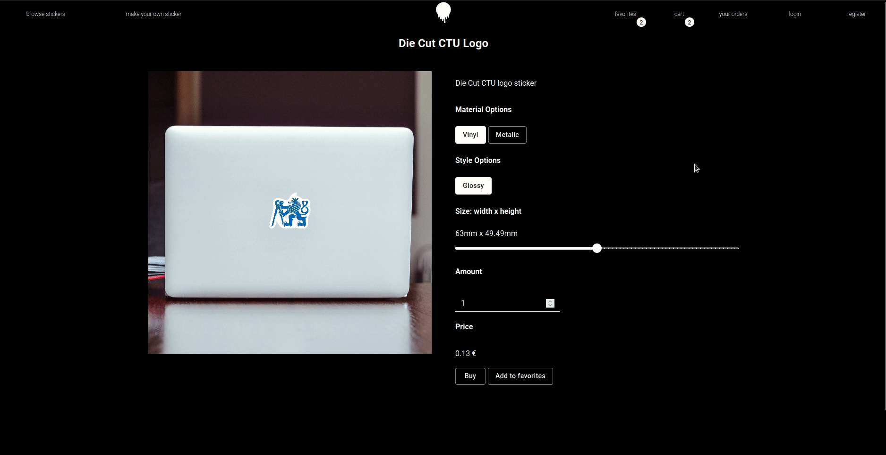

# Implementation of a web application for ordering and automatic printing of custom stickers

## <b>Bachelor's thesis at Czech Technical University in Prague source code</b>
## Department of Control Engineering, CTU in Prague, FEE

### by Peter Basár

-----------------------------

## What

This document contains an overview of the files located in this directory as well as short description of different ways one can run the application and presentation of its functions.

<b>Application accessible on address (as of 29.5.2022):  
https://sticker-application-frontend.herokuapp.com/</b>

## Files in this directory

<ul>
  <li><b>AWS-media-copy/</b></li>
    This folder contains a copy of the AWS S3 storage server used by this application for storing sticker images, editor cutout images, user-uploaded canvases, sticker page familiar item background, and editor style backgrounds.
  
  <li><b>Run-locally/</b></li>
    This folder contains implementation of server-side implementation in Django (subfolder <i>web_app_django</i>) as well as client-side implementation in React (subfolder <i>web_app_react/</i>).
     
    This implementation is bascially the same as the one in <b><i>Run-with-heroku/</i></b> but prepared to be run locally (local PostgreSQL database, local React API url). 

  <li><b>Run-with-Heroku/</b></li>
    This folder contains implementation of server-side implementation in Django (subfolder <i>web_app_django</i>) as well as client-side implementation in React (subfolder <i>web_app_react/</i>).
     
    This implementation is bascially the same as the one in <b><i>Run-locally/</i></b> but prepared to be run on Heroku's dyno instances 1 for backend and 1 for frontend. It contains neccessary files such as Procfile, and different neccessarry settings in Django settings and React package.json.
  
  <li><b>Worker/</b></li>
    This folder contains the basic implementation of a Python script that connects to the database, searches for paid orders, downloads the print and cutout images, changes order status and prints the images using the default printer.

  <li><b>API-testing-files/</b></li>
    Postman collections for manual API response testing. 
    https://learning.postman.com/docs/getting-started/importing-and-exporting-data/ 

  <li><b>Media/</b></li>
    Media for presenting this application

  <li><b>thesis.pdf</b></li>
    Copy of a bachelor's thesis

</ul>

## Technologies used

- <b>Django</b> (backend)
- <b>React</b> (frontend)
- <b>PostgreSQL</b> (database)
- <b>Python</b> (automated printing)
- <b>AWS S3</b> (storage for sticker images)

## How to use this application

#### 1. I want to run the application on Heroku's dyno instance   (the easiest way)

The easiest way to run this application is to setup backend and frontend on 2 separate Heroku Dyno instances. 
  
One instance will be for backend and one for frontend. The backend one will aditionally requiere PostgreSQL addon, available in the Heroku addons list. 
 
https://devcenter.heroku.com/articles/django-app-configuration
 
https://blog.heroku.com/deploying-react-with-zero-configuration
  
Additionally, setting up AWS S3 instance and uploading to it the folder in <b><i>AWS-media-copy/sticker-application-storage/</i></b> and make it public. 
  
At last, uploading the backedup PostgreSQL database (in folder <b><i>Database-backup/</i></b>) using DBeaver software (recommended) (see https://dbeaver.com/docs/wiki/Backup-Restore/). 
  
Clear instructions and requierements in <b><i>Run-with-Heroku/readme.md</b></i> 

#### 2. I want to run the application locally

This application was developed on Ubuntu 20.04.
  
The second easiest way to run this application is to setup AWS S3 instance and upload to it the folder in <b><i>AWS-media-copy/sticker-application-storage/</i></b> and make it public. 
 
(It is possible to access the AWS folder locally but the application will require some adjustments in the settings and changing some constants as right now it runs https://django-storages.readthedocs.io/en/latest/ AWS S3)
  
Then, upload the backup PostgreSQL database (in folder <b><i>Database-backup/</i></b>) using DBeaver software (recommended) (see https://dbeaver.com/docs/wiki/Backup-Restore/). 
  
At last, running the Django and React in two terminals with all the requierements.
  
Clear instructions and requierements in <b><i>Run-locally/readme.md</b></i> 

#### 3. Running the worker

If the database is accessible by the worker and this computer has a default printer all that is needed is to specify PostgreSQL database credentials in the <b><i>Worker/worker.py</i></b> script and run the script.

## Media

#### Architecture

#### Filtering and adding stickers to cart and favorites

##### Product page

##### Editor

##### Register and login

##### Additional media including current and past designs in <b>Media/</b> folder

## License

<b>The Unlicense</b>

A license with no conditions whatsoever which dedicates works to the public domain. Unlicensed works, modifications, and larger works may be distributed under different terms and without source code.